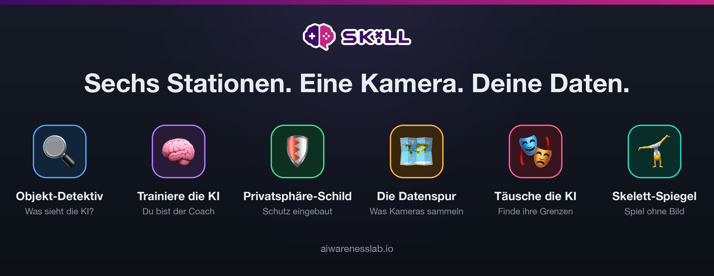
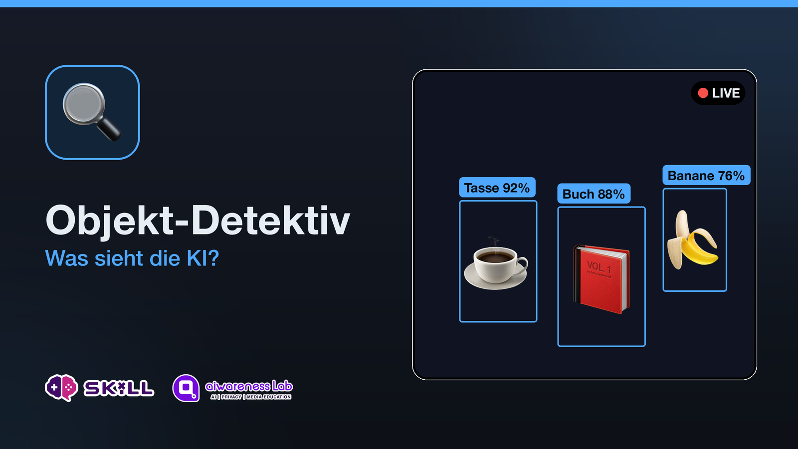
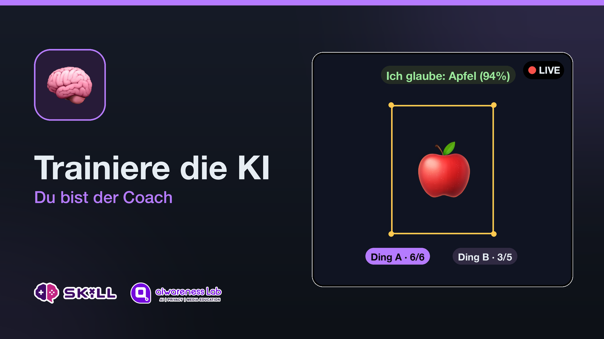
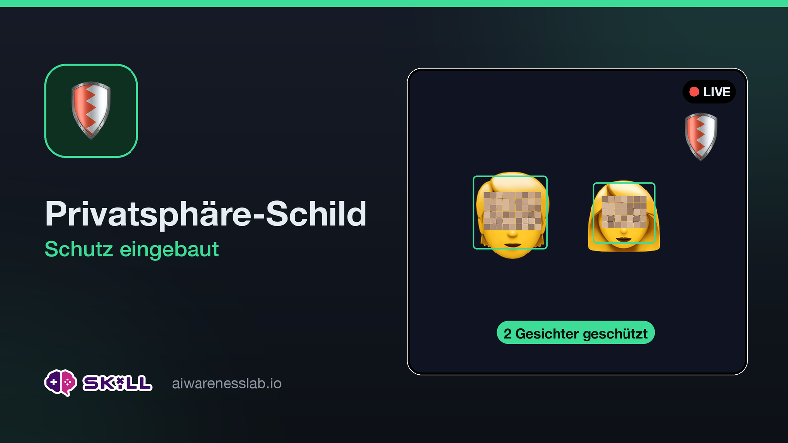
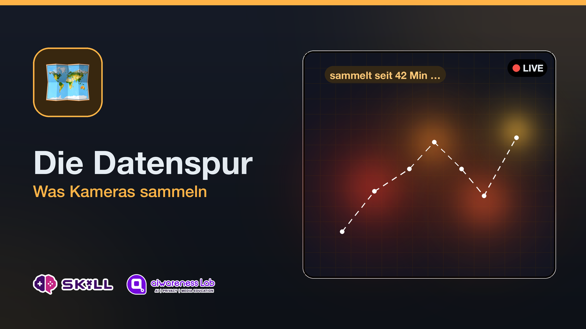
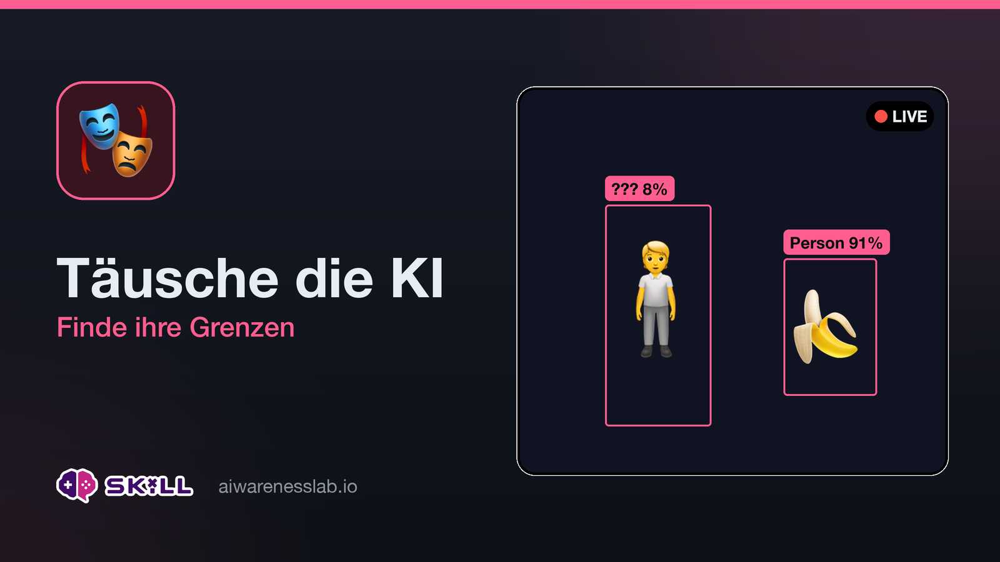
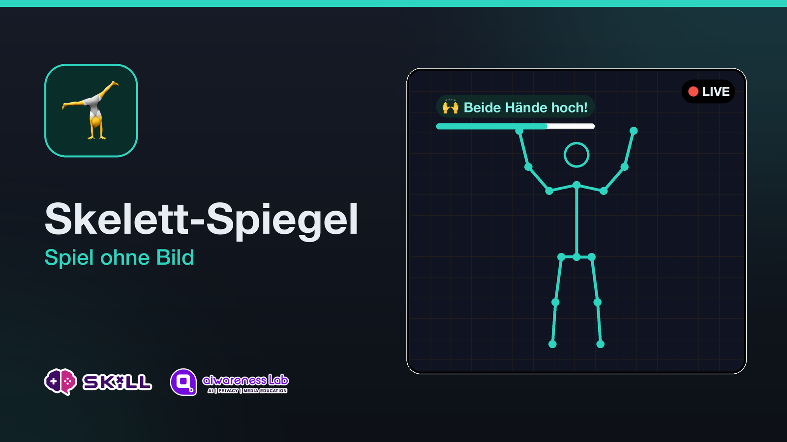

# KI-Werkstatt · Anleitung: Aufbau, Betrieb & Fehlerbehebung

Diese Anleitung führt dich von der leeren SD-Karte bis zur laufenden
Ausstellung — und hilft, wenn etwas klemmt. Für die inhaltliche
Moderation (Stationen, Lernziele, Diskussion) siehe
[workshop/leitfaden.md](workshop/leitfaden.md).

> 🇬🇧 English version: [MANUAL.md](MANUAL.md)



## Die Stationen auf einen Blick

<table>
  <tr>
    <td></td>
    <td></td>
  </tr>
  <tr>
    <td></td>
    <td></td>
  </tr>
  <tr>
    <td></td>
    <td></td>
  </tr>
</table>

*Alle Bilder liegen in [assets/stations/](assets/stations/) (DE + EN) und
werden mit `python3 setup/make_station_cards.py` neu erzeugt.*

---

## 1 · Was du brauchst

### Hardware

- Raspberry Pi 5 (mit min. 4 GB) + offizielles 27-W-USB-C-Netzteil
  (schwächere Netzteile machen mit AI HAT + Kamera Probleme!)
- Raspberry Pi AI HAT (AI Kit / AI HAT+ — jede Variante, die das Paket
  `hailo-all` unterstützt)
- Eine Kamera — beides wird automatisch erkannt, auch im laufenden
  Betrieb umsteckbar:
  - **Raspberry Pi Kamera** (Camera Module 3 oder AI Camera) + Kamerakabel
    für den Pi 5 (schmale Anschlüsse; das richtige Kabel liegt neuen
    Kameras meist bei), **oder**
  - **jede USB-Webcam** (einfach hinten einstecken)
- microSD-Karte, mind. 16 GB
- Kleines Stativ oder Halterung für die Kamera
- Optional, aber sehr praktisch: Ethernet-Kabel für Wartung
  (wenn der Hotspot läuft, hat der Pi über WLAN kein Internet)

**Sonstiges:** Ein Laptop mit Kartenlesegerät oder Adapter zum Flashen der SD-Karte, ein Drucker für das Poster und die Stationskarten, eine Requisiten-Kiste (siehe Leitfaden).

---

## 2 · Hardware zusammenbauen

1. **Zuerst das Kamerakabel** am Pi einstecken (Verriegelung vorsichtig
   hochziehen, Kabel einstecken, Verriegelung zudrücken) — *bevor* der
   HAT drauf ist, danach kommt man schlecht dran. Ausrichtung: siehe
   Aufdruck/Anleitung von Kabel und Kamera; wenn die Kamera später nicht
   erkannt wird, ist zu 90 % dieses Kabel falsch herum oder nicht ganz
   eingerastet.
2. AI HAT mit Abstandshaltern auf den Pi schrauben und auf die
   GPIO-Leiste stecken. Fest andrücken — ein halb sitzender HAT ist die
   häufigste Ursache für „Hailo nicht gefunden“.
3. Kamera anschließen, aufstellen, grob auf den Spielbereich richten
   (2–4 m Abstand ist ideal).

---

## 3 · SD-Karte vorbereiten

1. **Raspberry Pi Imager** auf dem Laptop installieren
   (raspberrypi.com/software).
2. Auswählen: Gerät **Raspberry Pi 5** → OS **Raspberry Pi OS (64-bit)**
   (Bookworm) → deine SD-Karte.
3. Im Imager unter „Einstellungen bearbeiten“ (Zahnrad):
   - Benutzername/Passwort setzen (merken!)
   - Dein Heim-WLAN eintragen (nur fürs Installieren; auf der
     Veranstaltung läuft später der eigene Hotspot)
   - **SSH aktivieren** — damit kannst du den Pi vom Laptop aus warten
4. Schreiben lassen, SD-Karte in den Pi, einschalten.

---

## 4 · Software installieren

Projektordner auf den Pi kopieren (USB-Stick oder vom Laptop aus):

```bash
scp -r raspberrypi5 <benutzer>@raspberrypi.local:~/ki-werkstatt
```

Dann auf dem Pi (per SSH `ssh <benutzer>@raspberrypi.local` oder mit
Tastatur/Monitor):

```bash
cd ~/ki-werkstatt
bash setup/install.sh
sudo reboot
```

Der Installer holt alle Pakete (u. a. `hailo-all` — das dauert!),
kopiert die App nach `/opt/ki-werkstatt` und richtet den Autostart ein.
**Der Neustart am Ende ist Pflicht** — erst danach werden Hailo-Firmware
und Treiber geladen.

> Optional für volle Hailo-Leistung: `sudo raspi-config` →
> *Advanced Options* → *PCIe Speed* → Gen 3 aktivieren, nochmal
> neu starten.

---

## 5 · Funktionstest

Nach dem Neustart startet die Ausstellung automatisch. Prüfe am Pi
(oder per SSH):

```bash
systemctl status ki-werkstatt
```

→ muss `active (running)` zeigen. Dann vom Laptop im selben Netz:
`http://raspberrypi.local` öffnen (bzw. die IP des Pi).

**Der Footer der Webseite ist deine Statusanzeige:**

| Footer zeigt | Bedeutung |
| --- | --- |
| ⚡ *KI-Chip aktiv (…hef)* | Hailo läuft — alles gut |
| 🐢 *Demo-Modus ohne KI-Chip* | App läuft, aber Hailo fehlt → Abschnitt 9.3 |
| 📷 *Pi-Kamera* | Kamera erkannt |
| 📷 *Testbild* | Kamera **nicht** erkannt → Abschnitt 9.2 |

Wenn beides grün ist: einmal alle sechs Stationen durchklicken.

---

## 6 · Hotspot & Poster

Das Poster übernimmt automatisch das Logo aus `app/static/logo.png` —
zum Austauschen einfach diese Datei (und `logo-icon.png` fürs
Browser-Symbol) ersetzen und das Poster neu erzeugen.

WLAN-Name und Passwort in [setup/hotspot.sh](setup/hotspot.sh) anpassen
(und identisch in [setup/make_poster.py](setup/make_poster.py)!), dann:

```bash
bash setup/hotspot.sh
python3 setup/make_poster.py
```

Das Skript erzeugt beide Sprachfassungen: `setup/poster_de.html`
(Titel „KI-Werkstatt“) und `setup/poster_en.html` (Titel
„AI-Lab2Go“). Die passende im Browser öffnen und auf A4 drucken.
Ab jetzt: WLAN **KI-Werkstatt** beitreten → `http://10.42.0.1` öffnen
(http, **nicht** https — Browser ergänzen gern falsch!).

**Der Hotspot startet ab jetzt bei jedem Boot automatisch** (mit Vorrang
vor deinem Heim-WLAN) — Strom an genügt, die Ausstellung ist komplett
autark. Wieder ausschalten (dauerhaft, z. B. zum Updaten über WLAN):

```bash
bash setup/hotspot.sh off
```

Danach verbindet sich der Pi wieder normal mit dem Heim-WLAN;
`bash setup/hotspot.sh` schaltet zurück in den Veranstaltungsmodus.

**Vor der Veranstaltung ändern:** Moderations-PIN in
[app/config.py](app/config.py) (`ADMIN_PIN`) und das Hotspot-Passwort.
Nach Änderungen: `bash setup/install.sh` erneut ausführen (kopiert die
Dateien nach `/opt`) und `sudo systemctl restart ki-werkstatt`.

---

## 7 · Betrieb am Veranstaltungstag

Morgens nur: **Strom an, 2 Minuten warten, mit dem Handy testen.**
Alles startet von selbst.

- Moderationsfunktionen: Footer-Link „Moderator:in“ → PIN eingeben →
  Stationen sperren / alles zurücksetzen
- Zwischendurch aufräumen (Trainingsdaten, Datenspur): „♻️ Alles
  zurücksetzen“ in der Moderationsleiste
- Notfall-Universallösung: Strom aus/an. Der Pi bootet direkt wieder in
  die Ausstellung.

---

## 7b · Ausstellungsmodus mit Beamer

Unter **`http://10.42.0.1/beamer`** liefert die Ausstellung eine passive
**Beamer-/TV-Ansicht** für Vorbeigehende: links das Live-Bild, rechts große
Live-Zähler (gerade geschützte Gesichter, erkannte Objekte, „NICHT in die
Cloud geladen", kartierter Raumanteil), dazu rotierende zweisprachige
Denkanstöße und ein QR-Code zum Mitmachen. Keine Bedienelemente — wer
steuern will, nimmt das Handy.

- **Auto-Tour:** Interagiert ~90 Sekunden niemand, wandert die Ausstellung
  selbstständig durch die visuellen Stationen (alle 25 s weiter). Sobald
  jemand am Handy etwas antippt, stoppt die Tour sofort. Einstellbar in
  [app/config.py](app/config.py) (`EXHIBIT_…`).
- **Anschluss:** Entweder einen Laptop an den Beamer hängen und dort
  `/beamer` im Vollbild öffnen — oder den **Pi selbst** als Zuspieler
  nutzen (HDMI an den Beamer):

```bash
bash setup/kiosk.sh
```

  Danach startet Chromium bei jedem Boot vollbild auf der Beamer-Seite
  (inkl. Bildschirmschoner-Abschaltung). Wieder aus: `bash setup/kiosk.sh off`.

- Die Zähler leben nur im Arbeitsspeicher; „♻️ Alles zurücksetzen" in der
  Moderationsleiste nullt auch sie.

---

## 8 · Vorschau auf dem Laptop (ohne Pi)

Zum Ausprobieren und für Änderungen an Texten/Design:

```bash
python3 -m venv .venv && . .venv/bin/activate
pip install -r dev/requirements-dev.txt
python3 app/main.py --source webcam
```

Dann `http://localhost:8080` öffnen. Ohne Kamera: `--source fake`
(bewegtes Testbild mit simulierten Erkennungen — alle Stationen
funktionieren). Der Gesichtsschutz funktioniert mit `--source webcam`
sogar richtig, nur die Objekterkennung läuft ohne Hailo im Demo-Modus.

---

## 9 · Fehlerbehebung

### 9.0 Die 90-Sekunden-Diagnose

1. **Leuchtet die Power-LED?** Nein → Netzteil/Kabel.
2. **Lädt `http://10.42.0.1`?** Nein → 9.1
3. **Footer ansehen:** 📷 Testbild? → 9.2 · 🐢 Demo-Modus? → 9.3
4. **Bild da, aber ruckelt?** → 9.4
5. Alles andere → 9.5 ff.

### 9.1 Seite lädt nicht

- Ist das Gerät wirklich im WLAN „KI-Werkstatt“? (Handys wechseln gern
  heimlich zurück ins bekannte Netz, weil der Hotspot kein Internet hat.
  Meldung „Netzwerk hat kein Internet — trotzdem verbinden?“ →
  **trotzdem verbinden!**)
- Adresse exakt `http://10.42.0.1` — ohne https, ohne www.
- Läuft der Hotspot? Auf dem Pi:

```bash
nmcli connection show --active
```

  → `ki-werkstatt-hotspot` muss gelistet sein. Wenn nicht:
  `bash setup/hotspot.sh` erneut ausführen.

- Läuft die App? `systemctl status ki-werkstatt` — wenn nicht:

```bash
sudo systemctl restart ki-werkstatt
journalctl -u ki-werkstatt -n 50 --no-pager
```

  Die letzten Logzeilen zeigen den Fehler (Python-Traceback ganz unten
  lesen).

### 9.2 Bild zeigt „Keine Kamera gefunden“

Das ist **kein Absturz** — das System läuft weiter und sucht von selbst
alle 3 Sekunden nach einer Kamera (erst Pi-/AI-Kamera, dann alle
USB-Anschlüsse). In fast allen Fällen genügt:

1. **USB-Kamera:** aus- und wieder einstecken (jeder USB-Port ist okay).
   Nach wenigen Sekunden ist das Bild zurück — ganz ohne Neustart.
2. **Pi-/AI-Kamera (Flachbandkabel):** Strom aus, Kabel an *beiden* Enden
   prüfen (ganz eingesteckt? Verriegelung zu? richtige Ausrichtung?),
   Strom an. Das Kabel ist in 90 % der Fälle das Problem.
   ⚠️ Das Flachbandkabel nie bei laufendem Gerät umstecken!
3. Zur Diagnose (per SSH): `rpicam-hello --list-cameras` — wird dort
   nichts gelistet, ist es Hardware/Kabel.

Das rote „stockt“-Bild für 1–2 Sekunden ist normal, wenn eine Kamera
kurz hakt — das System fängt das selbst ab.

### 9.3 Footer zeigt „🐢 Demo-Modus“ — Hailo/AI HAT nicht gefunden

Die Ausstellung läuft dann trotzdem (bewusst so gebaut!), nur die
Objekterkennung ist eingeschränkt. Zum Beheben, in dieser Reihenfolge:

1. **Einmal neu starten** — nach der Erstinstallation Pflicht:
   `sudo reboot`
2. Wird der Chip gesehen?

```bash
hailortcli fw-control identify
```

1. `identify` schweigt, obwohl der Chip am PCIe-Bus hängt? Prüfe die
   **Chip-Generation** — sie braucht das jeweils passende Treiber-Paket:

```bash
lspci | grep -i hailo
```

- **„Hailo-10H"** (AI HAT+ 2) → `sudo apt install -y hailo-h10-all`
- **„Hailo-8"** (AI Kit / AI HAT+) → `sudo apt install -y hailo-all`

   Danach neu starten. Der Installer erkennt das inzwischen automatisch;
   dieser Fall betrifft vor allem ältere Installationen. (Genau dieser
   Fehler äußert sich übrigens auch als
   `HAILO_OUT_OF_PHYSICAL_DEVICES(74)` im Log.)

1. Auch in `lspci` taucht nichts auf? Hardware prüfen:

```bash
dmesg | grep -i hailo
```

   Keine Ausgabe → Strom aus, **HAT fest auf die GPIO-Leiste drücken**,
   Abstandshalter kontrollieren, Strom an.
5. Chip da, aber App meldet „Kein Hailo-Modell gefunden“ →

```bash
ls /usr/share/hailo-models/
```

   Leer? → `sudo apt install --reinstall hailo-models` und neu starten.
   Es gibt Dateien, aber keine passt? → Den Dateinamen in
   `HEF_CANDIDATES` in [app/config.py](app/config.py) eintragen
   (Modelle für den Hailo-10H enden auf `_h10.hef`, für Hailo-8/8L
   auf `_h8.hef`/`_h8l.hef`).
6. Immer noch nichts: `sudo apt update && sudo apt full-upgrade -y`
   (aktualisiert auch die Hailo-Pakete), neu starten.

### 9.4 Stream ruckelt / Seite wird bei vielen Geräten zäh

- In [setup/hotspot.sh](setup/hotspot.sh) `BAND="a"` setzen (5 GHz —
  deutlich mehr Durchsatz, wenn alle Geräte es können) und Hotspot neu
  anlegen: `bash setup/hotspot.sh`
- In [app/config.py](app/config.py): `STREAM_MAX_FPS` auf 8–10 senken
  und/oder `JPEG_QUALITY` auf 60
- Pi möglichst frei aufstellen (nicht hinter Metall/Beamer), Geräte
  nah am Pi halten
- Nach Config-Änderungen: `bash setup/install.sh` +
  `sudo systemctl restart ki-werkstatt`

### 9.5 Farben sehen falsch aus (rot/blau vertauscht)

In [app/config.py](app/config.py) `MODEL_EXPECTS_RGB` auf den anderen
Wert stellen, installieren, Service neu starten. Betrifft nur die
Erkennungsqualität, nicht das Kamerabild selbst.

### 9.6 Gesichtsschutz erkennt Gesichter schlecht

Der Gesichtsfinder braucht **frontale, gut beleuchtete** Gesichter —
Seitenprofile und Gegenlicht versagen. Das ist Absicht bzw. ehrlich
eingebaut (siehe Station 3: „Ehrliche Warnung“) und ein Lernmoment,
kein Defekt. Verbessern: Licht von vorn, Kamera auf Gesichtshöhe.

### 9.7 „Trainiere die KI“ rät schlecht

Das ist fast immer ein Trainingsdaten-Problem (und damit Lehrstoff!):

- Mehr Beispiele (8–10 pro Ding), **verschiedene** Winkel/Entfernungen
- Gegenstand groß in den blauen Rahmen halten
- Sehr ähnliche Objekte (zwei Tassen) sind für das einfache Verfahren
  wirklich schwer — nimm unterscheidbarere Dinge
- Chaos von vielen Nutzern? → „🗑️ Alles vergessen lassen“ und neu

### 9.8 Moderations-PIN vergessen

Steht in [app/config.py](app/config.py) unter `ADMIN_PIN` — auf dem Pi
live in `/opt/ki-werkstatt/app/config.py` nachsehen:

```bash
grep ADMIN_PIN /opt/ki-werkstatt/app/config.py
```

### 9.9 App zum Debuggen von Hand starten

Mehr Ausgabe sieht man beim manuellen Start:

```bash
sudo systemctl stop ki-werkstatt
cd /opt/ki-werkstatt
python3 app/main.py --port 8080
```

Fehlermeldung lesen/notieren, danach `Strg+C` und
`sudo systemctl start ki-werkstatt`.

### 9.10 Code-Änderungen einspielen

Ein Befehl vom Laptop aus — kopiert, installiert nach `/opt` und startet
den Dienst neu:

```bash
bash setup/deploy.sh
```

Läuft der Hotspot (Pi nicht im Heimnetz), gib die Hotspot-Adresse mit:

```bash
bash setup/deploy.sh dan@10.42.0.1
```

Am Ende zeigt das Skript die Statuszeilen aus dem Log — dort müssen
Kamera, KI-Chip, Pose-Modell und Gesichtsschutz stehen.

### 9.11 Privatsphäre-Schild macht nichts unkenntlich

Die Station zeigt es dir inzwischen selbst an (rote Warnung im Panel).
Prüfen, welcher Gesichtsfinder läuft:

```bash
journalctl -u ki-werkstatt -b --no-pager | grep "Face guard"
```

- `yunet` → bestes Modell aktiv (liegt im Projekt unter `app/models/`)
- `haar` → Notfall-Modell; funktioniert, erkennt aber weniger
- `none` → gar keiner: `sudo apt install -y opencv-data` und
  `bash setup/deploy.sh` (die ONNX-Datei muss in `/opt/ki-werkstatt/app/models/`
  liegen)

Erkennt der Schutz einzelne Gesichter nicht, liegt das an der Physik der
Modelle: seitliche Profile, starkes Gegenlicht und sehr kleine Gesichter
sind schwer. Kamera auf Gesichtshöhe und Licht von vorn helfen — und
genau diese Grenze ist Lernstoff in Station 3.

---

## 10 · Spickzettel

| Zweck | Befehl (auf dem Pi) |
| --- | --- |
| Status der App | `systemctl status ki-werkstatt` |
| App neu starten | `sudo systemctl restart ki-werkstatt` |
| Live-Logs | `journalctl -u ki-werkstatt -f` |
| AI HAT prüfen | `hailortcli fw-control identify` |
| Kamera prüfen | `rpicam-hello --list-cameras` |
| Hotspot an / aus | `bash setup/hotspot.sh` / `… off` |
| Aktive Netzwerke | `nmcli connection show --active` |
| Poster erzeugen | `python3 setup/make_poster.py` |
| Änderungen einspielen | `bash setup/deploy.sh` (vom Laptop) |
| Alles neu | Strom aus/an — startet vollautomatisch |

**Adresse für Gäste:** WLAN „KI-Werkstatt“ → `http://10.42.0.1`

---

## Lizenz & Kontakt

Dieses Projekt ist Open Source unter der **MIT-Lizenz** (siehe
[LICENSE](LICENSE)).

© 2026 **Dan Verständig** · <verstaendig@c3s.uni-frankfurt.de> ·
[medienbildung.team](https://medienbildung.team)
