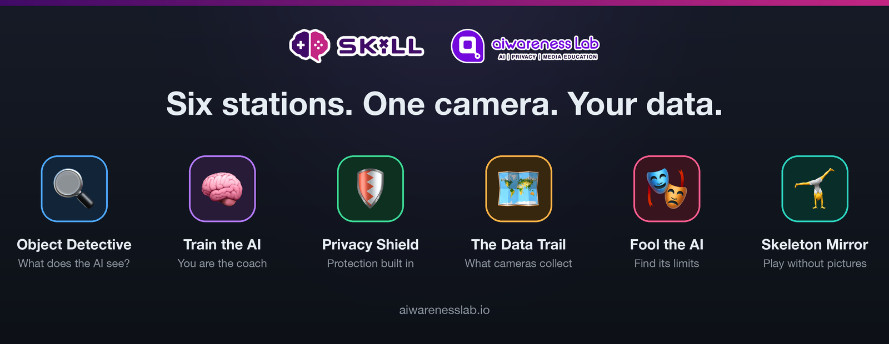
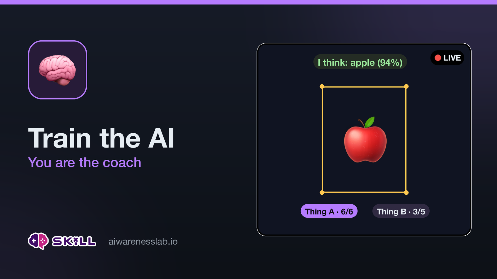
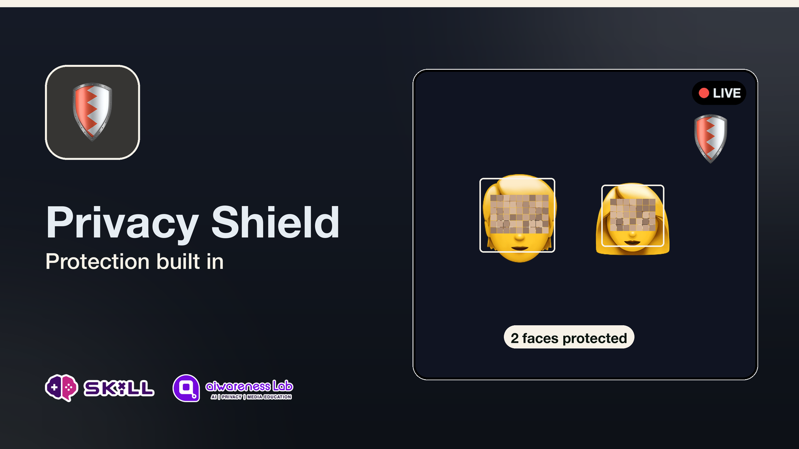
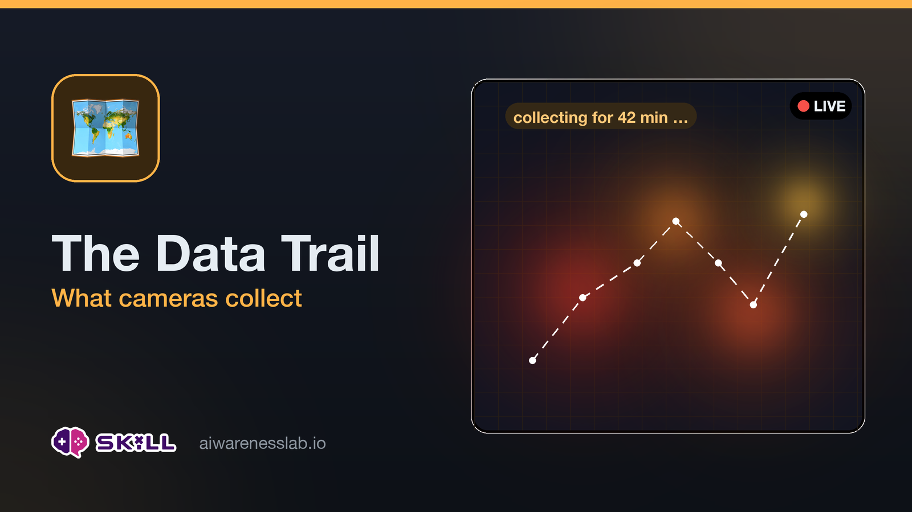
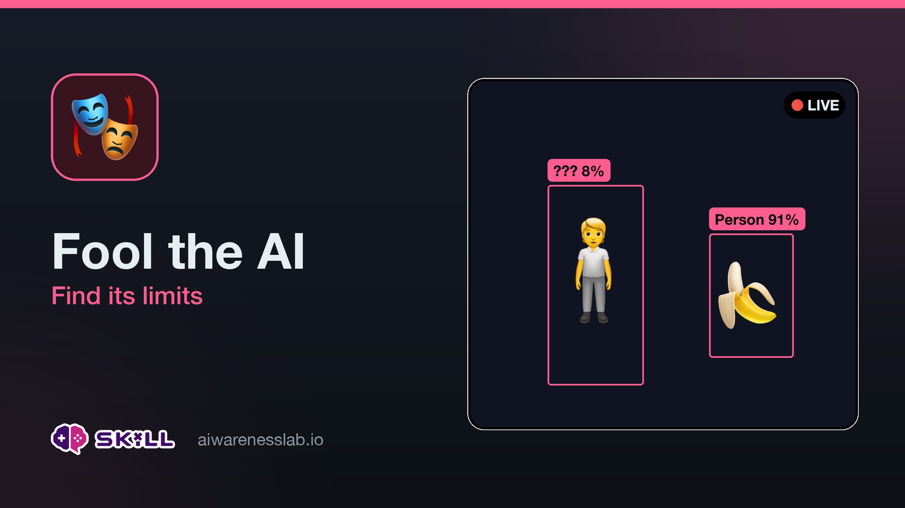
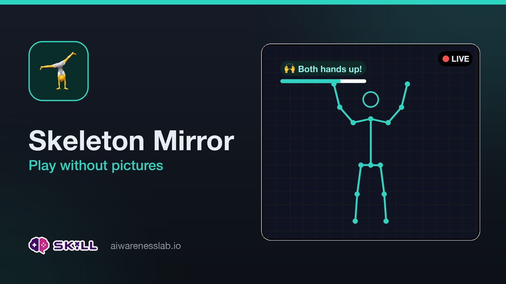

# KI-Werkstatt · Manual: Assembly, Operation & Troubleshooting

> 🇩🇪 Deutsche Version: [ANLEITUNG.md](ANLEITUNG.md)

This manual takes you from a blank SD card all the way to a running
exhibit — and helps you out when something gets stuck. For the content
side of running the show (stations, learning goals, discussion), see
[workshop/leitfaden.md](workshop/leitfaden.md) (German only for now).



## The stations at a glance

<table>
  <tr>
    <td></td>
    <td></td>
  </tr>
  <tr>
    <td></td>
    <td></td>
  </tr>
  <tr>
    <td></td>
    <td></td>
  </tr>
</table>

*All images live in [assets/stations/](assets/stations/) (DE + EN) and are
regenerated with `python3 setup/make_station_cards.py`.*

---

## 1 · What you need

### Hardware

- Raspberry Pi 5 (with at least 4 GB) + the official 27 W USB-C power
  supply (weaker supplies cause trouble with the AI HAT + camera!)
- Raspberry Pi AI HAT (AI Kit / AI HAT+ — any variant supported by the
  `hailo-all` package)
- A camera — both kinds are auto-detected and can even be swapped
  while running:
  - a **Raspberry Pi camera** (Camera Module 3 or AI Camera) + a camera
    cable for the Pi 5 (narrow connectors; new cameras usually ship with
    the right cable), **or**
  - **any USB webcam** (just plug it into the back)
- microSD card, at least 16 GB
- A small tripod or mount for the camera
- Optional but very handy: an Ethernet cable for maintenance
  (while the hotspot is running, the Pi has no internet over Wi-Fi)

**Other things:** A laptop with a card reader or adapter for flashing the SD card, a printer for the poster and the station cards, and a box of props (see the workshop guide).

---

## 2 · Assemble the hardware

1. **Plug in the camera cable first** (gently pull up the latch, insert
   the cable, press the latch shut) — *before* the HAT goes on top;
   afterwards it's hard to reach. Orientation: check the markings and
   instructions on the cable and camera. If the camera isn't detected
   later, 90 % of the time this cable is the wrong way round or not
   fully clicked in.
2. Screw the AI HAT onto the Pi with the standoffs and press it onto
   the GPIO header. Push it down firmly — a half-seated HAT is the most
   common cause of "Hailo not found".
3. Connect the camera, set it up, and point it roughly at the play area
   (2–4 m distance is ideal).

### 2.1 Optional: a printed housing for the USB camera

The ELP 48 MP module ships as a bare double-deck PCB — fragile and awkward
in front of an audience. [`hardware/`](hardware/README.md) has ready-made
STL files for a vented housing with a ¼"-20 tripod thread. The existing ELP
cases on Thingiverse and Printables do **not** fit this module: they are all
built for older single-deck boards with an M12 lens barrel.

| | |
|---|---|
| Print | body lens-face down, back plate flat, **no supports** |
| Material | **PETG, not PLA** — the module runs warm and PLA softens near 55 °C |
| Settings | 0.2 mm layers, 3 perimeters, 20 % infill, ≈ 40 g |
| Also needed | 4× M3 × 12 mm self-tapping screws, 1× ¼"-20 hex nut (only for the tripod thread) |

Assembly: slide the nut into the pedestal slot, unplug the camera cable,
drop the board in lens-first, plug the cable back in and route it out of any
ventilation slot, then screw the back plate on. If the board still has play,
add one of the printed 1 mm shims behind it — the stack height varies
between production runs. Check the live picture afterwards: if it is upside
down, turn the board 180°, because the software does not rotate it.

Full details, including which dimensions are measured and which are
assumed, are in [hardware/README.md](hardware/README.md) (German).

---

## 3 · Prepare the SD card

1. Install the **Raspberry Pi Imager** on your laptop
   (raspberrypi.com/software).
2. Select: device **Raspberry Pi 5** → OS **Raspberry Pi OS (64-bit)**
   (Bookworm) → your SD card.
3. In the Imager, under "Edit settings" (gear icon):
   - Set a username and password (remember them!)
   - Enter your home Wi-Fi (only for the installation; at the event the
     Pi later runs its own hotspot)
   - **Enable SSH** — so you can maintain the Pi from your laptop
4. Let it write, put the SD card in the Pi, power on.

---

## 4 · Install the software

Copy the project folder onto the Pi (USB stick, or from your laptop —
`<benutzer>` is your username):

```bash
scp -r raspberrypi5 <benutzer>@raspberrypi.local:~/ki-werkstatt
```

Then on the Pi (via SSH `ssh <benutzer>@raspberrypi.local`, or with a
keyboard and monitor):

```bash
cd ~/ki-werkstatt
bash setup/install.sh
sudo reboot
```

The installer fetches all packages (including `hailo-all` — this takes
a while!), copies the app to `/opt/ki-werkstatt`, and sets up autostart.
**The reboot at the end is mandatory** — only then are the Hailo
firmware and drivers loaded.

> Optional, for full Hailo performance: `sudo raspi-config` →
> *Advanced Options* → *PCIe Speed* → enable Gen 3, then reboot
> once more.

---

## 5 · Functional test

After the reboot, the exhibit starts automatically. Check on the Pi
(or via SSH):

```bash
systemctl status ki-werkstatt
```

→ must show `active (running)`. Then, from a laptop on the same
network, open `http://raspberrypi.local` (or the Pi's IP address).

**The footer of the web page is your status display:**

| Footer shows | Meaning |
| --- | --- |
| ⚡ *AI chip active (…hef)* | Hailo is running — all good |
| 🐢 *Demo mode without AI chip* | App is running, but Hailo is missing → section 9.3 |
| 📷 *Pi camera* | Camera detected |
| 📷 *Test pattern* | Camera **not** detected → section 9.2 |

The header has a DE/EN language toggle (remembered per device) — in
German the same rows read „KI-Chip aktiv", „Demo-Modus ohne KI-Chip",
„Pi-Kamera" and „Testbild".

Next to it, **System** opens a separate window with temperatures,
fan and AI chip — not needed in normal operation, but it is the first
place to look when the Pi runs hot or the picture stutters
(section 9.12).

If both are green: click through all six stations once.

---

## 6 · Hotspot & poster

The poster automatically picks up the logo from `app/static/logo.png` —
to swap it, just replace that file (and `logo-icon.png` for the browser
icon) and regenerate the poster.

Adjust the Wi-Fi name and password in [setup/hotspot.sh](setup/hotspot.sh)
(and identically in [setup/make_poster.py](setup/make_poster.py)!), then:

```bash
bash setup/hotspot.sh
python3 setup/make_poster.py
```

The script writes both language versions: `setup/poster_de.html`
(title “KI-Werkstatt”) and `setup/poster_en.html` (title
“AI-Lab2Go”). Open the one you need in a browser and print it on A4.
From now on: join the Wi-Fi network **KI-Werkstatt** → open
`http://ki.lokal` (fallback if a device won't resolve the name:
`http://10.10.10.1` — the QR codes point at the IP). Use http, **not**
https — browsers love to "fix" this the wrong way!

**From now on the hotspot starts automatically on every boot** (taking
priority over your home Wi-Fi) — just plugging in the power is enough;
the exhibit is fully self-contained. To turn it off again (permanently,
e.g. to update over Wi-Fi):

```bash
bash setup/hotspot.sh off
```

After that, the Pi connects to your home Wi-Fi again as usual;
`bash setup/hotspot.sh` switches back to event mode.

**Change before the event:** the moderation PIN in
[app/config.py](app/config.py) (`ADMIN_PIN`) and the hotspot password.
After changes: run `bash setup/install.sh` again (copies the files to
`/opt`) and `sudo systemctl restart ki-werkstatt`.

---

## 7 · Operation on event day

In the morning, all you do is: **power on, wait 2 minutes, test with
your phone.** Everything starts by itself.

- Moderation functions: footer link "Moderator" („Moderator:in") →
  enter the PIN → lock stations / reset everything
- Tidying up in between (training data, data trail): "♻️ Reset
  everything" in the moderation bar
- Emergency catch-all: power off/on. The Pi boots straight back into
  the exhibit.

---

## 7b · Exhibition mode with a projector

At **`http://ki.lokal/beamer`** the exhibit serves a passive
**projector/TV view** for passers-by: the live picture on the left, big
live counters on the right (faces currently shielded, objects spotted,
"NOT uploaded to any cloud", share of the room mapped), plus rotating
bilingual thought-starters and a QR code to join in. No controls — anyone
who wants to steer uses their phone.

- **Auto-tour:** if nobody interacts for ~90 seconds, the exhibit tours
  the visual stations by itself (moving on every 25 s). The moment someone
  taps anything on a phone, the tour stops. Tunable in
  [app/config.py](app/config.py) (`EXHIBIT_…`).
- **Hook-up:** either connect a laptop to the projector and open `/beamer`
  full-screen — or use the **Pi itself** as the player (HDMI to the
  projector):

```bash
bash setup/kiosk.sh
```

  Chromium then starts full-screen on the wall page on every boot (screen
  blanking disabled). Turn off again: `bash setup/kiosk.sh off`.

- The counters live in RAM only; "♻️ Reset everything" in the moderation
  bar clears them too.

---

## 8 · Preview on your laptop (without a Pi)

For trying things out and for changes to texts/design:

```bash
python3 -m venv .venv && . .venv/bin/activate
pip install -r dev/requirements-dev.txt
python3 app/main.py --source webcam
```

Then open `http://localhost:8080`. No camera? Use `--source fake`
(a moving test pattern with simulated detections — all stations work).
The face guard even works for real with `--source webcam`; only the
object detection runs in demo mode without Hailo.

---

## 9 · Troubleshooting

### 9.0 The 90-second diagnosis

1. **Is the power LED on?** No → power supply/cable.
2. **Does `http://ki.lokal` load?** No: try `http://10.10.10.1` first
   (IP works but the name doesn't → restart the hotspot once:
   `bash setup/hotspot.sh`). Neither loads → 9.1
3. **Look at the footer:** 📷 Test pattern? → 9.2 · 🐢 Demo mode? → 9.3
4. **Picture is there, but stutters?** → 9.4
5. Everything else → 9.5 onwards.

### 9.1 Page doesn't load

- Is the device really on the "KI-Werkstatt" Wi-Fi? (Phones love to
  sneak back to a known network, because the hotspot has no internet.
  Prompt "This network has no internet — stay connected?" →
  **stay connected!**)
- Address exactly `http://ki.lokal` (or `http://10.10.10.1`) — no
  https, no www.
- Is the hotspot running? On the Pi:

```bash
nmcli connection show --active
```

  → `ki-werkstatt-hotspot` must be listed. If not:
  run `bash setup/hotspot.sh` again.

- Is the app running? `systemctl status ki-werkstatt` — if not:

```bash
sudo systemctl restart ki-werkstatt
journalctl -u ki-werkstatt -n 50 --no-pager
```

  The last log lines show the error (read the Python traceback at the
  very bottom).

### 9.2 Footer shows "📷 Test pattern" — camera not detected

```bash
rpicam-hello --list-cameras
```

- **"No cameras available"** → power off, check the camera cable at
  *both* ends (fully inserted? latch closed? correct orientation?).
  The cable is the problem in 90 % of cases.
- Camera is listed, but the app still shows the test pattern →
  `sudo systemctl restart ki-werkstatt`. If that doesn't help: check
  whether another program is blocking the camera (only one app can
  use it).

### 9.3 Footer shows "🐢 Demo mode" — Hailo/AI HAT not found

The exhibit still runs in this case (built that way on purpose!), only
the object detection is limited. To fix it, in this order:

1. **Reboot once** — mandatory after the initial installation:
   `sudo reboot`
2. Is the chip being seen?

```bash
hailortcli fw-control identify
```

1. `identify` stays silent even though the chip is on the PCIe bus?
   Check the **chip generation** — each one needs its matching driver
   package:

```bash
lspci | grep -i hailo
```

- **"Hailo-10H"** (AI HAT+ 2) → `sudo apt install -y hailo-h10-all`
- **"Hailo-8"** (AI Kit / AI HAT+) → `sudo apt install -y hailo-all`

   Then reboot. The installer detects this automatically these days;
   this case mainly affects older installations. (By the way, this
   exact error also shows up as
   `HAILO_OUT_OF_PHYSICAL_DEVICES(74)` in the log.)

1. Nothing shows up in `lspci` either? Check the hardware:

```bash
dmesg | grep -i hailo
```

   No output → power off, **press the HAT firmly onto the GPIO
   header**, check the standoffs, power on.
5. Chip is there, but the app reports "No Hailo model found" →

```bash
ls /usr/share/hailo-models/
```

   Empty? → `sudo apt install --reinstall hailo-models` and reboot.
   There are files, but none fits? → Add the filename to
   `HEF_CANDIDATES` in [app/config.py](app/config.py)
   (models for the Hailo-10H end in `_h10.hef`, for the Hailo-8/8L
   in `_h8.hef`/`_h8l.hef`).
6. Still nothing: `sudo apt update && sudo apt full-upgrade -y`
   (this also updates the Hailo packages), then reboot.

### 9.4 Stream stutters / page gets sluggish with many devices

- In [setup/hotspot.sh](setup/hotspot.sh), set `BAND="a"` (5 GHz —
  much more throughput if all devices support it) and recreate the
  hotspot: `bash setup/hotspot.sh`
- In [app/config.py](app/config.py): lower `STREAM_MAX_FPS` to 8–10
  and/or `JPEG_QUALITY` to 60
- Place the Pi as freely as possible (not behind metal or a projector),
  keep devices close to the Pi
- After config changes: `bash setup/install.sh` +
  `sudo systemctl restart ki-werkstatt`

### 9.5 Colors look wrong (red/blue swapped)

In [app/config.py](app/config.py), flip `MODEL_EXPECTS_RGB` to the
other value, install, restart the service. This only affects detection
quality, not the camera image itself.

### 9.6 Face guard is bad at detecting faces

The face finder needs **frontal, well-lit** faces — side profiles and
backlight defeat it. This is intentional, or rather honestly built in
(see station 3: "Honest warning" / „Ehrliche Warnung"), and a teaching
moment, not a defect. To improve it: light from the front, camera at
face height.

### 9.7 "Trainiere die KI" (train the AI) guesses badly

This is almost always a training-data problem (and therefore teaching
material!):

- More examples (8–10 per thing), from **different** angles/distances
- Hold the object large inside the blue frame
- Very similar objects (two mugs) really are hard for the simple
  method — pick more distinguishable things
- Chaos left behind by many users? → "🗑️ Make it forget everything"
  („Alles vergessen lassen") and start fresh

### 9.8 Forgot the moderation PIN

It's in [app/config.py](app/config.py) under `ADMIN_PIN` — check the
live copy on the Pi in `/opt/ki-werkstatt/app/config.py`:

```bash
grep ADMIN_PIN /opt/ki-werkstatt/app/config.py
```

### 9.9 Start the app by hand for debugging

You see more output when starting manually:

```bash
sudo systemctl stop ki-werkstatt
cd /opt/ki-werkstatt
python3 app/main.py --port 8080
```

Read/note the error message, then `Ctrl+C` and
`sudo systemctl start ki-werkstatt`.

### 9.10 Deploying code changes

One command from your laptop — copies the files, installs to `/opt`,
and restarts the service:

```bash
bash setup/deploy.sh
```

If the hotspot is running (Pi not on your home network), pass the
hotspot address:

```bash
bash setup/deploy.sh dan@10.10.10.1
```

At the end, the script shows the status lines from the log — camera,
AI chip, pose model, and face guard must all appear there.

### 9.11 Privatsphäre-Schild (privacy shield) isn't blurring anything

The station now tells you itself (red warning in the panel). Check
which face finder is running:

```bash
journalctl -u ki-werkstatt -b --no-pager | grep "Face guard"
```

- `yunet` → best model active (ships with the project under `app/models/`)
- `haar` → fallback model; works, but detects less
- `none` → none at all: `sudo apt install -y opencv-data` and
  `bash setup/deploy.sh` (the ONNX file must be in `/opt/ki-werkstatt/app/models/`)

If the guard misses individual faces, that's down to the physics of
the models: side profiles, strong backlight, and very small faces are
hard. A camera at face height and light from the front help — and this
exact limitation is teaching material in station 3.

### 9.12 Temperature, fan, AI chip: the system window

When the Pi runs hot, the picture stutters, or you cannot hear the fan:
the footer of the web UI has a **System** link. It opens a separate
window with the technical readout — deliberately kept off the visitor
interface, because nobody at a station wants to see temperatures.

It shows the Pi's processor temperature, the temperature of the AI chip on
the AI HAT, fan speed, whether the Pi has ever throttled, plus camera,
frame rate and how often the camera had to reconnect. Also reachable
directly at `http://ki.lokal/system`.

What the warnings mean:

- **"No fan detected"** → the Active Cooler's plug is disconnected. The
  small 4-pin connector sits **at the top right of the Pi board, between
  the 40-pin GPIO header and the USB sockets** — with an AI HAT fitted it
  ends up underneath and hard to reach, which is exactly why it tends to
  slip out while seating the HAT. **Power the Pi off**, take the HAT off,
  reseat the plug, reassemble, boot again. Important: the Pi only looks
  for the fan at power-on; plugging it in while running is not enough.
- **Fan "stopped" and shown in red** → it reports 0 rpm although the Pi is
  warm, so it is stuck or blocked.
- **Above 80 °C with the fan running** → vents blocked? Enclosed case
  without airflow? Direct sunlight?

No panic needed: from about 82 °C the Pi throttles itself (the picture
just gets slower, nothing breaks). Below 50 °C the fan deliberately stands
still — not hearing it is normal then. The AI chip usually runs a good
deal cooler than the Pi's own processor.

---

## 10 · Cheat sheet

| Purpose | Command (on the Pi) |
| --- | --- |
| App status | `systemctl status ki-werkstatt` |
| Restart the app | `sudo systemctl restart ki-werkstatt` |
| Live logs | `journalctl -u ki-werkstatt -f` |
| Check the AI HAT | `hailortcli fw-control identify` |
| Check the camera | `rpicam-hello --list-cameras` |
| Hotspot on / off | `bash setup/hotspot.sh` / `… off` |
| Active networks | `nmcli connection show --active` |
| Generate the poster | `python3 setup/make_poster.py` |
| Deploy changes | `bash setup/deploy.sh` (from the laptop) |
| Fresh start | Power off/on — starts fully automatically |

**Address for guests:** Wi-Fi "KI-Werkstatt" → `http://ki.lokal`

---

## License & Contact

This project is open source under the **MIT license** (see
[LICENSE](LICENSE)).

© 2026 **Dan Verständig** · <verstaendig@c3s.uni-frankfurt.de> ·
[medienbildung.team](https://medienbildung.team) ·
[aiwarenesslab.io](https://aiwarenesslab.io)
