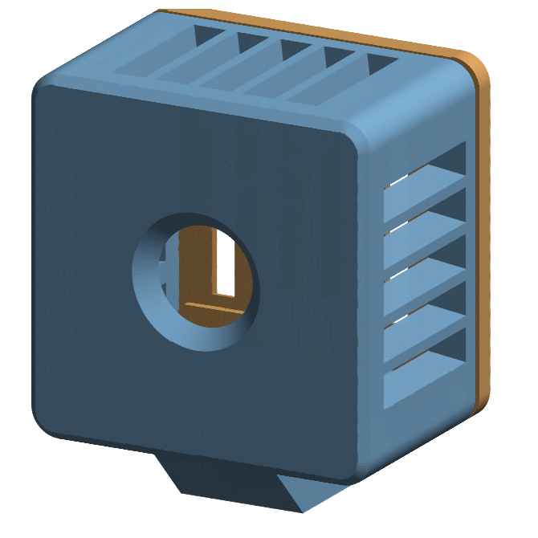
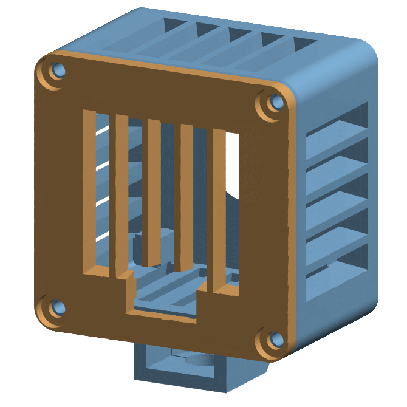
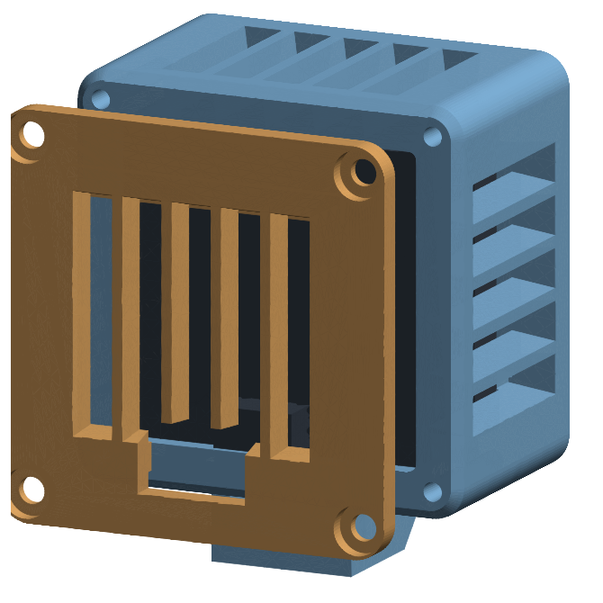

# Kameragehäuse für das ELP 48MP Autofokus-Modul

3D-Druck-Gehäuse für die USB-Kamera der KI-Werkstatt
(**ELP-USB48MP01-AF70**, 38 × 38 mm Double-Deck-Platine).

|  |  |  |
|---|---|---|
| vorne | hinten | zerlegt |

Fertige Druckdateien liegen in [`stl/`](stl/). Wer Maße ändern will, bearbeitet
[`case_elp48mp.py`](case_elp48mp.py) und ruft auf:

```bash
bash setup/tools.sh case
```

---

## 1 · Warum ein eigenes Gehäuse?

Für ältere ELP-Module gibt es viele fertige Gehäuse auf Thingiverse und
Printables — aber **keines passt auf dieses Modul**. Die vorhandenen Modelle
sind für einlagige Platinen mit M12-Objektivtubus gebaut; das 48-MP-Modul ist
ein zweilagiger Platinenstapel mit winzigem Autofokus-Block statt
Objektivgewinde — und in unserem Aufbau sitzt dahinter zusätzlich ein
**passiver Kühlkörper auf 12-mm-Abstandshaltern** (Platte 4 mm). Der
4-Pin-Stecker verlässt den Stapel **unten mittig nach hinten**. Beides ist
in Rev 2 eingearbeitet: Das Gehäuse ist tiefer, die Rückplatte ist ein
Lamellengitter über dem Kühler mit Durchlass für Stecker und Kabel, und
alle Wände tragen gefaste Kühlrippen.

Dazu kommt der eigentliche Anlass: **das Modul wird im Betrieb spürbar warm.**
Ein dichtes Gehäuse würde das verschlimmern, deshalb ist dieses hier an allen
vier Seiten und auf der Rückseite offen.

## 2 · Was du brauchst

| Teil | Menge | Hinweis |
|---|---|---|
| `elp48-case-body.stl` | 1× | Gehäusekörper |
| `elp48-case-back.stl` | 1× | Rückplatte |
| `elp48-case-shim.stl` | 0–4× | 1-mm-Ausgleichsrahmen, siehe Schritt 5 |
| Schrauben M3 × 12 mm, selbstschneidend | 4× | Blech- oder Kunststoffschrauben; Holzschrauben gehen auch |
| Sechskantmutter ¼"-20 (UNC) | 1× | nur wenn du das Stativgewinde nutzen willst |

**Filament: PETG, nicht PLA.** PLA wird ab etwa 55 °C weich — genau der
Bereich, in den sich ein Gehäuse um eine warme Kamera in einem sonnigen
Ausstellungsraum bewegt. PETG hält rund 75 °C aus. ASA oder ABS gehen auch.

## 3 · Drucken

| Einstellung | Wert |
|---|---|
| Lage | Gehäusekörper mit der **Objektivseite nach unten** aufs Bett, Rückplatte flach |
| Stützstruktur | **keine** — dafür ist alles konstruiert |
| Schichthöhe | 0,2 mm |
| Perimeter | 3 |
| Füllung | 20 % |
| Materialbedarf | ca. 29 cm³, rund 37 g |
| Druckzeit | gut 3 Stunden |

Fertiges Maß: **50 × 50 × 35 mm**, der Stativsockel ragt 9 mm nach unten.
Die einzigen Überhänge sind die Decken der Lüftungsschlitze — kurze Brücken
von gut 5 mm, die jeder Drucker schafft; die 45°-Fasen an Rippen und
Außenkanten drucken stützenfrei.

## 4 · Zusammenbau

1. **Mutter einsetzen** (nur bei Stativnutzung): Die ¼"-Mutter von der
   **Gehäuserückseite** in den Kanal im Sockel schieben — Ecke nach oben,
   so wie der Sechskant unten geformt ist — bis sie in ihrer Tasche
   einrastet. Sie kann dort nicht mehr herausfallen, sobald die Rückplatte
   sitzt.
2. **Kabel abziehen.** Der Stecker sitzt auf der unteren Platine und lässt
   sich abnehmen — das macht den Einbau leichter.
3. **Platine einlegen**, Objektiv voran. Sie fällt in den Schacht und liegt
   vorn auf vier Ecknasen auf.
4. **Kabel wieder anstecken.** Stecker und Kabel verlassen das Gehäuse
   durch die **Kerbe unten in der Rückplatte** — der Spalt zwischen den
   beiden unteren Andruckbalken ist genau dafür da.
5. **Rückplatte auflegen** und mit den vier M3-Schrauben festziehen. Ihre
   Andruckbalken drücken auf die **Kühlerplatte** (nicht auf die
   Elektronik); der Kühler gibt die Kraft über seine Abstandshalter an die
   Platinen weiter. *Wackelt das Modul noch?* Einen Ausgleichsrahmen
   (`shim`) zwischen Kühler und Balken legen, erneut schließen — die
   Bauhöhen schwanken zwischen Produktionsserien.
6. **Bild prüfen.** Steht es auf dem Kopf, die Platine um 180° gedreht
   einlegen. Die Software dreht das Bild nicht.

## 5 · Montage

* **Stativ / Klemme:** ¼"-Gewinde im Sockel — passt auf jedes Fotostativ,
  jeden Magic Arm und jede Tischklemme.
* **Feste Wand:** Der Sockel lässt sich auch direkt anschrauben; alternativ
  hält doppelseitiges Klebeband auf der Rückplatte.

## 6 · Maße, und was daran unsicher ist

Der Hersteller veröffentlicht für dieses Modul nur die Platinengröße
(„Double-deck, 38 mm × 38 mm"). **Das Lochbild der Befestigungsbohrungen
nennt er nirgends** — deshalb benutzt dieses Gehäuse es gar nicht. Die
Platine wird stattdessen wie eine Fensterscheibe gehalten:

```
Frontwand ─ 4 Ecknasen ─ [Platinenstapel] ─ Andruckrahmen ─ Rückplatte
```

Die Ecknasen landen dabei auf den Schraubenköpfen, mit denen die beiden
Platinen verschraubt sind — das ist gewollt und stabil. Die Gehäusetiefe
wird nicht geraten, sondern **aus der Stapelkette berechnet** — der
Generator druckt bei jedem Lauf eine Passungstabelle und prüft per
Kollisionstest, dass Gehäuse und Modul sich nirgends schneiden:

```
Frontwand · Linsenluft · Platinen · Abstandshalter · Kühler · Andruckspalt
   2,6         6,0         6,0          12,0           4,0        1,0
```

Nachgemessen am echten Modul sind Abstandshalter (12), Kühler (4) und der
Stecker (10 × 5, unten mittig). Geschätzt bleiben:

| Parameter | Annahme | Wenn es nicht passt |
|---|---|---|
| `stack_h` | 6 mm Platinen-Sandwich | Wert anpassen — die Tiefe rechnet sich selbst nach |
| `lens_offset` | 6 mm Luft vor der Platine | erhöhen, wenn der Autofokus-Block anstößt |
| `cooler_w` | 38 mm Kühlerbreite | verkleinern, falls der Kühler schmaler ist |

Eine einzige Messung am echten Gerät klärt alles: **Vorderkante Platine bis
Rückseite Kühler.** Weicht sie von 22 mm ab, `stack_h` entsprechend ändern
und neu generieren — Tiefe, Balken und Kerbe ziehen automatisch mit.

Alles andere ist mit Toleranz gebaut: 0,4 mm Luft ringsum die Platine, und
die Linsenöffnung ist mit 14 mm innen deutlich größer als nötig, damit der
82°-Bildwinkel auf keinen Fall am Rand abgeschattet wird.

## 7 · Und die Wärme?

Die Kamera wird warm — das ist bei diesem Modul normal und kein Defekt
(ELP nennt 0–70 °C Betriebstemperatur). Das Gehäuse hilft dabei, statt zu
schaden:

* Zwanzig gefaste Lamellenschlitze in den Wänden plus Lamellengitter in
  der Rückplatte direkt über dem Kühler — der Kamineffekt zieht die warme
  Luft am Kühlkörper vorbei nach draußen.
* Der Sockel hält das Gehäuse von der Tischplatte weg, sodass unten Luft
  nachströmen kann.

**Nicht zusätzlich einpacken.** Kein Stoff darüber, keine Vitrine ohne
Belüftung, keine direkte Sonne.
